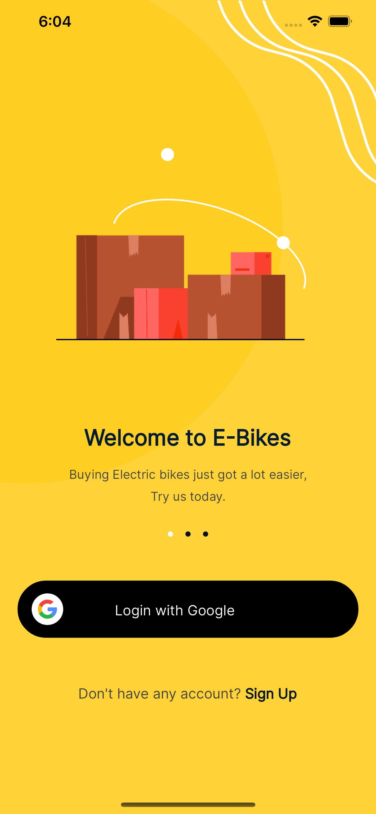
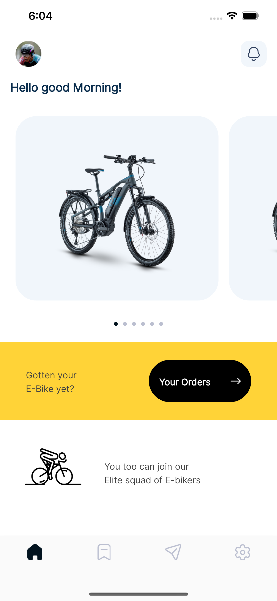
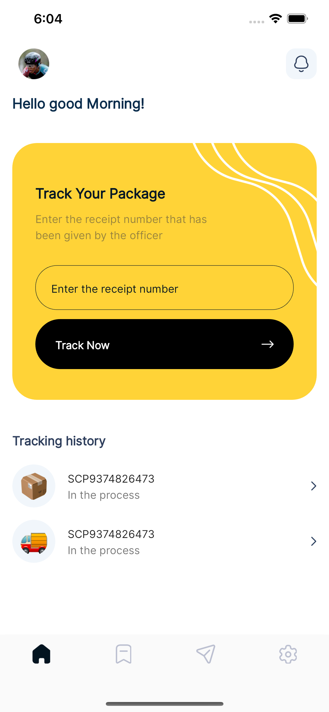
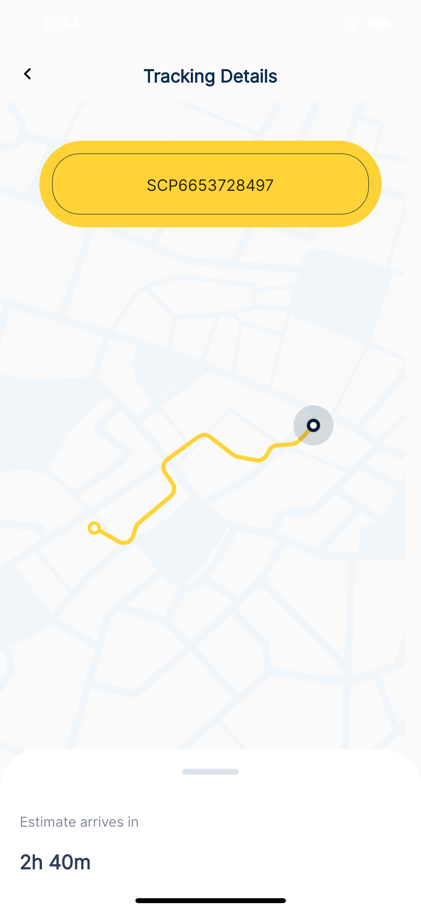
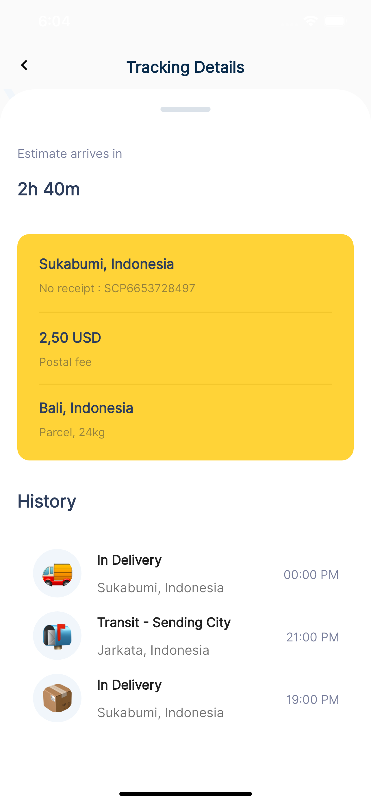

# delivery_app_talentql

  This is a delivery app that represents an assessment task for a talentQL.

## video representation

https://github.com/benthemobileguy/Talentql_assessment_deliveryapp/assets/26816781/af53ca04-727b-4cfc-9e0f-9fefed7bdeae

## screenshots of the app that was made

|Login|Home|Home2| Tracking                      |Tracking Details|
|---|---|---|-----------------------------------|---|
||||  ||

1. Login screen: Login Screen, tap on Login with Google to navigate to the Home Screen
2.Home Screen: Contains a horizontal swipable page view with card view items, with "Your Orders" button navigating to the tracking page
3. Tracking Page: Contains a tracking history list, text field to enter the receipt number, and button to track the item. It would naigate to the tracking details page when tapped.
4. Tracking Details: Contains the tracking number, map and Draggable bottom sheet - closed initially
5. The bottom sheet can be expanded to see more details about the item.

## Widget Testing

I added some widget testing on the app. To run it, use this command:

`flutter test test/app_test.dart`

To run the project locally, run this command:

`flutter run`
